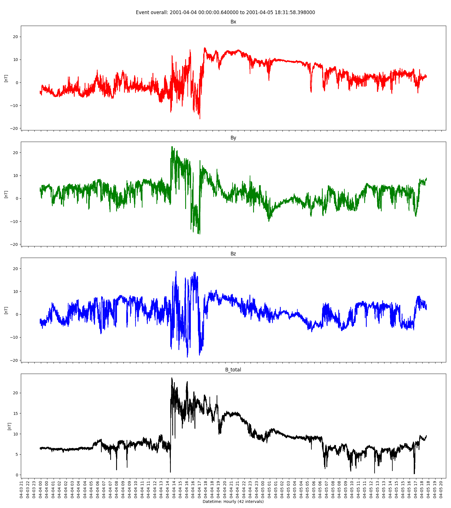
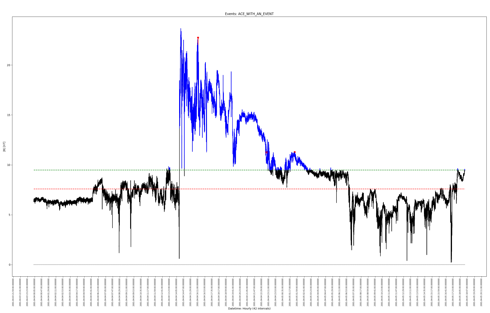
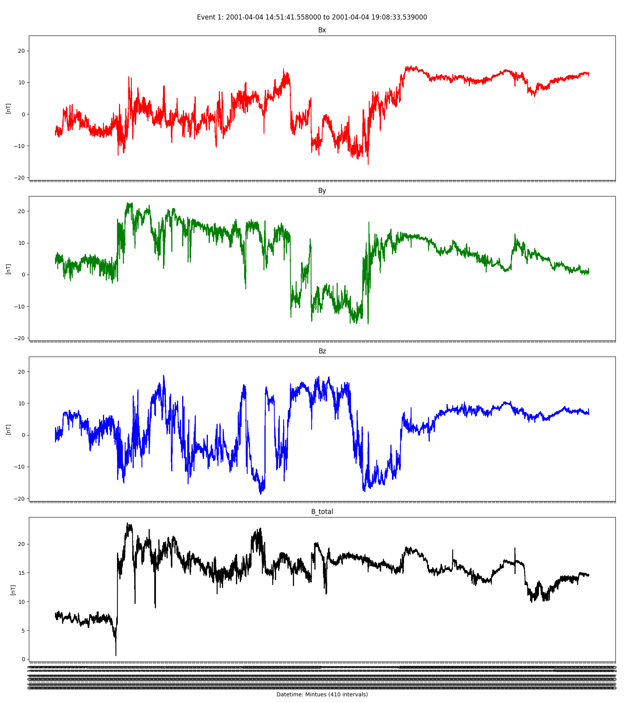
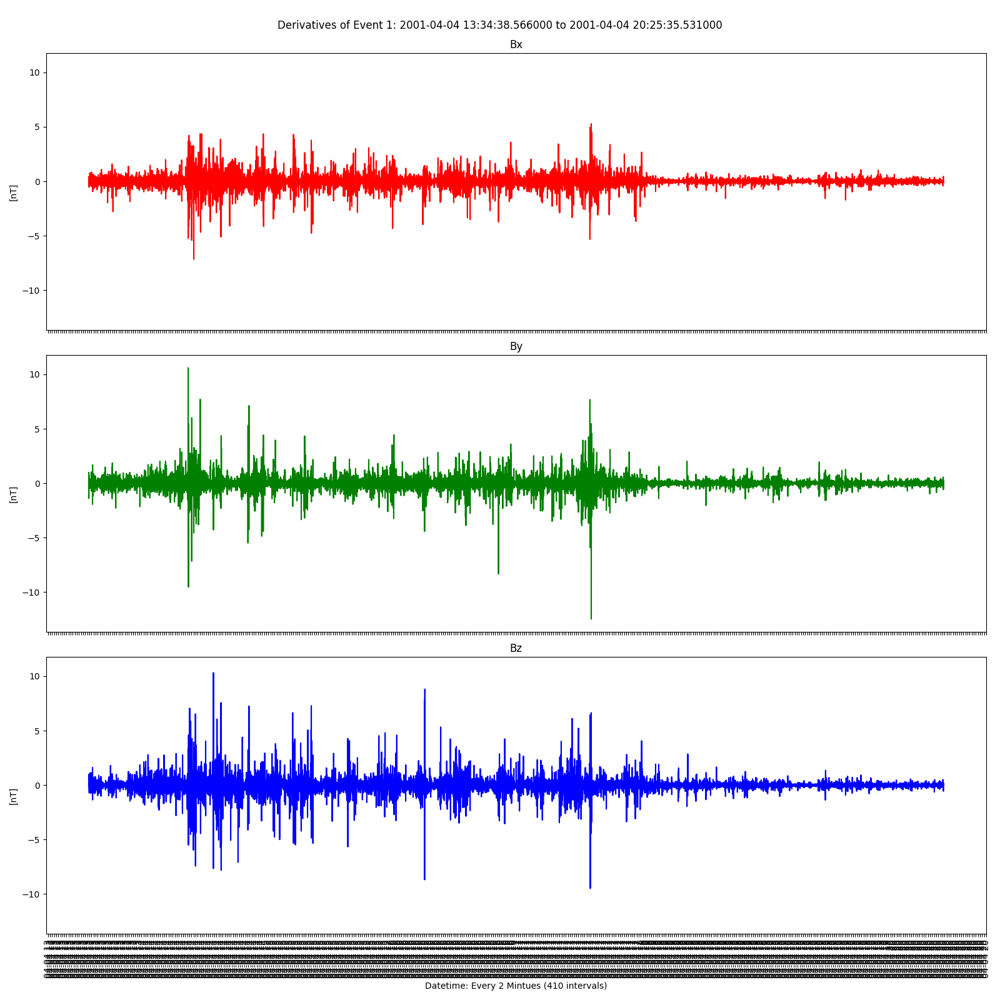
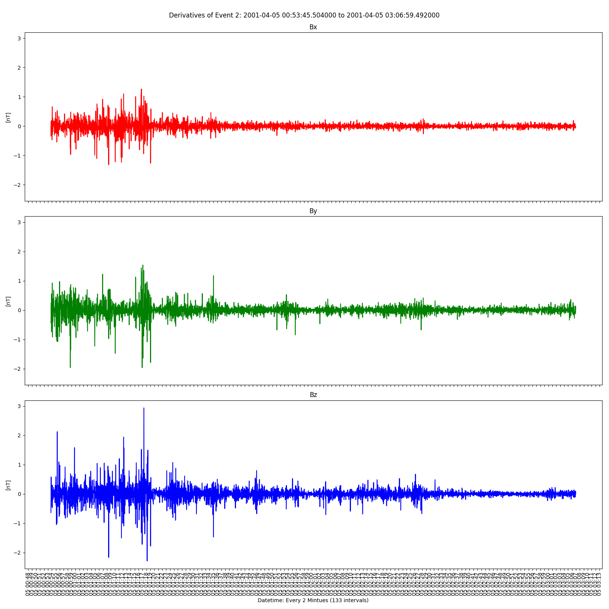

# IFE_SEARCH

Looking for Interplanetary Field Enhancements (IFEs) (Russell et al. 1985a) in ACE magnetometer data (GSE coordinates). IFEs were first identified in associated with the passage of an asteroid with the Venusian orbit and are believed to be the result of charged dust interactions with the flowing solar wind. The evolution and geoeffectiveness of IFEs is still an area of active research, so fast and objective identification of IFEs at 1 AU is important.

Example of identified event:


__Selection Criteria (Lai et al. 2017):__
1. Total Magnetic field enhancement > 25% (relative to ambient |B|)
2. Duration of enhancement > 10 minutes
3. Current sheet is present at or within the peak of |B|

# To Run Code
1. Download or clone repo
2. Input data must be in GSE Coordinates

Required packages:

2. Running code:
```python ife_processing.py -F <filename>.txt```

3. Change any 'values subject to change'
```
percent_cutoff_value = .25 #%
percent_trimmed_from_mean = 0.45 #%
time_cutoff_in_minutes = 80 # minutes
update_mean_every_x_hours = 2 # hours
buffer_size = .30 #% add x seconds around any event found as a buffer
```

**Verbose Example Output Breakdown for ACE_WITH_AN_EVENT**

_Returns the total range in seconds, minutes, hours and days (rounded down)_
```
Processing: ACE_WITH_AN_EVENT.txt
Date range of data: '2001-4-4 0:0:0.640' to '2001-4-5 18:31:58.398'

datetime = 153119
total_minutes = 2551
total_hours =   42
total_days =    1
```
_Generates Overall Graph for each sub value (bx, by, bz, btotal) and divides up the x-axis based on the size of the data_


```
Sub-graphs for bx, by, bz, btotal graph saved ACE_WITH_AN_EVENT_eventoverall.png, saved to output_img
(x-axis) multi HOUR time interval = 42
size of datetime: 153119 seconds = 2551.98 minutes = 42.533 hours

from 42.5330555556 hours in split into the total 42.5330555556 hours
split_time 153119.0, out of 153119 = 1.0 different means (rounded to 1)
trimmed mean:
[7.581958270750343]
25.0% cutoff:
[9.477447838437929]
time cutoff = 80 minutes
```
_Log warning that can ignore but indicates that multiple peaks are found_
```
LOG WARNING: duplicates max peaks found, 4!=2
mag time interval = 42
```
_Generates event overview graph well as the red/green line data for mean and trimmed mean. Possible events in blue, confirmed events will be checked from the events in blue to see if they last long enough to be considered_

_(Important Note: Although the 'update-mean-every-x-hours could be set to change within the graph, ACE-WITH-AN-EVENT is a small dataset so the mean/trimmed mean are set to the max hours in the data set to avoid missing smaller events so it won't change in this graph)_


```
Events graph saved ACE_WITH_AN_EVENT.png, saved to output_img
```
_Found events with range of times, possible events are checked against given range of values to see if they are above the trimmed mean and last for x amount of time_
```
Possible event from '2001-4-4 14:51:41.558' to '2001-4-4 19:8:33.539', for 15413 seconds or 256.8833 minutes
Possible event from '2001-4-5 1:18:44.501' to '2001-4-5 2:42:1.494', for 4998 seconds or 83.3000 minutes

Found 2 events with a 80 minutes cutoff
average possible event length 170.0917 minutes
```
_Generates sub-graphs (bx, by, bz, btotal) for each possible event and the derivatives for each graph as well_

Event 1



Event 2



```
Sub-graphs for bx, by, bz, btotal graph saved ACE_WITH_AN_EVENT_event1.png, saved to output_img
added 77.05 minutes buffer to either side of the found event
(x-axis) multi MINUTE time interval = 410
added 77.05 minutes buffer to either side of the found event
bx 12329, by 12329, bz 12329, date 12329

dev time interval = 410
time interval = 410
Derivatives for the event for bx, by, and bz graph saved ACE_WITH_AN_EVENT_event1_DER.png, saved to output_img
BX:
Max: 5.283 at 2001-04-04 15:35:23.554000
Min: -7.157 at 2001-04-04 13:59:53.562000
BY:
Max: 10.597 at 2001-4-4 15:15:35.558
Min: -12.478 at 2001-04-04 15:35:24.554000
BZ:
Max: 10.317 at 2001-04-04 14:04:37.562000
Min: -9.484 at 2001-04-04 15:35:10.554000

Sub-graphs for bx, by, bz, btotal graph saved ACE_WITH_AN_EVENT_event2.png, saved to output_img
added 24.9833333333 minutes buffer to either side of the found event
(x-axis) multi MINUTE time interval = 133
added 24.9833333333 minutes buffer to either side of the found event
bx 3997, by 3997, bz 3997, date 3997

dev time interval = 133
time interval = 133
Derivatives for the event for bx, by, and bz graph saved ACE_WITH_AN_EVENT_event2_DER.png, saved to output_img
BX:
Max: 1.269 at 2001-04-05 01:05:14.503000
Min: -1.316 at 2001-04-05 01:01:05.503000
BY:
Max: 1.537 at 2001-4-5 1:30:24.500
Min: -1.965 at 2001-04-05 01:05:20.503000
BZ:
Max: 2.935 at 2001-04-05 01:05:33.502000
Min: -2.286 at 2001-04-05 01:05:58.502000
```
_Returns the total time that the graphing and analysis took (range between a few seconds up to 20 minutes for 25+ events found)_
```
Graphing ran for 0:00:29.189331
```
# Current Output

With event:
```
trimmed mean = -0.814758658791
25% cutoff = -0.611068994093
time cutoff = 10 minutes
size of datetime: 14371 seconds, 239.52 minutes
total events = 3
average event length 22.2056 minutes
```
Without events:
```
trimmed mean = -0.56126
25% cutoff = -0.420945
time cutoff = 10 minutes
size of datetime: 6
```

Example of Identified Event:


# To Do

1. Adapt code to take in STEREO in GSE coordinates
